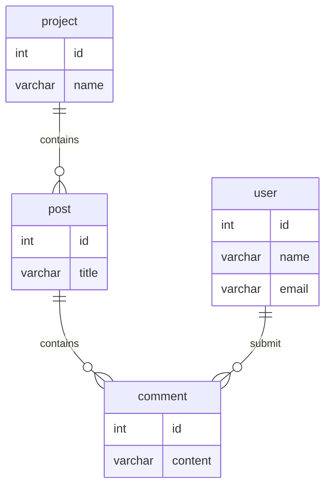

## 感慨

打开了自己的博客，发现上一次写博客都是去年6月份了，居然都过去一年了。感慨之余，突然想写点什么，就写写刚刚想到的自建评论系统吧。

## 起因

之前博客的评论系统是用的disqus，不过总是有点问题，每一篇文章都可以看到所有的评论。然后又折腾了一下，换了现在的这个[gitalk](https://github.com/gitalk/gitalk)。大概看了一下，做得还是挺巧妙的，用github的issue在存储评论，然后用gitalk的评论来显示评论。这样省下了自建服务器。不过搜索了一下，没有找到自建评论系统的开源项目，而使用像disqus或者gitalk这种还是会有一些限制。感觉开发一个自建评论系统还是可以多一种选择。

## 设计

### 框架选择

设计的话会考虑前后端分离的方式，后端打算使用[FastAPI](https://fastapi.tiangolo.com/)+[TortoiseORM](https://github.com/tortoise/tortoise-orm)，然后前端打算使用React，或者考虑只提供一个SDK，本来我前端也不擅长，估计弄出来也很丑。

### 数据库设计

### 用户

考虑接入Github和Google的oauth2，然后把用户的信息存储在数据库中。

## 实现

### 仓库地址

<https://github.com/long2ice/talkit>

暂时先创建一个仓库地址吧，后面有时间了再看。
